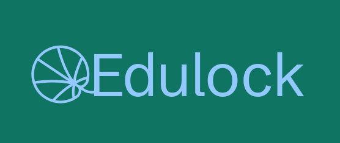

# Edulock – Simulador Educativo de Ransomware

Este projeto **NÃO DEVE SER EXECUTADO FORA DE UMA MÁQUINA VIRTUAL (VM)**.  

**Aviso:** Este código é apenas para fins académicos e educativos. Não implementa criptografia real nem deve ser usado fora de um ambiente controlado. A execução em sistemas reais (host) pode causar perda de dados, danos em ficheiros pessoais e comportamentos indesejados.

## Descrição

Edulock é um simulador educativo de ransomware desenvolvido em Python. Permite demonstrar o comportamento típico de ransomware sobre ficheiros de teste, sem causar qualquer dano real.

## Funcionalidades

- Atua apenas sobre uma pasta de teste definida pelo utilizador.  
- Modifica ficheiros de forma reversível usando Base64 e um marcador identificativo.  
- Renomeia ficheiros para simular bloqueio por ransomware.  
- Gera automaticamente uma nota de resgate com instruções de reversão.  
- Inclui modo de reversão que restaura os ficheiros originais.

## Uso

**Comandos principais (Windows / Linux):**

```bash
# Simulação (apenas altera/renomeia ficheiros de teste)
python ransomware_educativo.py simulate "C:\LAB\PASTA_TESTE" --ext .txt .docx .pdf

# Restauração dos ficheiros alterados
python ransomware_educativo.py restore "C:\LAB\PASTA_TESTE"
```

**Passos detalhados:**

1. Criar e configurar uma pasta de teste segura (ex.: `C:\LAB\PASTA_TESTE` ou `~/lab/teste` no Linux).  
2. Executar o script em modo `simulate` para observar alterações simuladas:  
   - Ficheiros elegíveis são transformados reversivelmente (Base64).  
   - Ficheiros são renomeados com a extensão `.edu_locked`.  
   - É criada a nota educativa `README_RESCATE_EDUCATIVO.txt`.  
3. Executar o script em modo `restore` para reverter as alterações:  
   - Ficheiros `.edu_locked` são restaurados ao estado original.  
   - A nota educativa pode ser apagada manualmente.

> **Dica:** Para integração com ferramentas de monitorização como Wazuh FIM, aponte a pasta de teste para gerar eventos sem risco real.

## Aviso Ético

Todo o desenvolvimento respeita normas de segurança e ética. O código destina-se apenas a estudo e treino, não a uso real.


